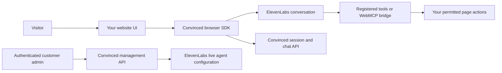

The Convinced Widget SDK connects your website to a conversation agent. Your application supplies the interface and permitted page actions; the SDK supplies session, voice, chat, tools and lifecycle APIs.

## Choose your integration

| Need | Use | Start here |
| --- | --- | --- |
| Hosted appearance with a small embed | Managed iframe and parent-page bridge | [Managed iframe](/guides/widget-sdk/managed-iframe) |
| A supplied UI with your brand | `mountConvincedWidget()` and `managed-v2` | [Quickstart](/guides/widget-sdk/quickstart) |
| Complete control of the interface | `ConvincedClient` and `ConvincedVoiceController` | [Custom UI](/guides/widget-sdk/custom-ui) |
| Explicit application actions | `ClientToolRegistry`, DOM tools or `createMcpTools()` | [Host tools](/guides/widget-sdk/host-tools) |
| Discover actions exposed by different websites | Experimental WebMCP bridge | [WebMCP](/guides/widget-sdk/webmcp) |
| Let customer admins edit saved instructions and the opener | `ConvincedAgentAdmin` plus the management backend | [Prompts and first message](/guides/widget-sdk/agent-prompts) |

## Handoff build and availability

<Note>
  WebMCP and saved prompt administration are available in `0.1.1-webmcp.2`, published under the npm `next` tag. Pin the exact version below. WebMCP remains experimental; prompt administration requires the matching authenticated backend and a registered agent owner.
</Note>

```bash
npm install --save-exact @convinced/widget-sdk@0.1.1-webmcp.2
```

Commit your package-manager lockfile so another developer can reproduce the build. Ordinary `npm install @convinced/widget-sdk` selects the stable `latest` tag, currently `0.1.0`, which does not include these new exports. The supplied tarball is an offline installation option.

The package contains ESM, TypeScript declarations, an optional browser IIFE, and reference examples. It works without React. The browser entry point never contains the ElevenLabs management key.

## What each part owns



The runtime and the management API serve different users. A visitor can converse and request approved actions. An administrator can edit the saved agent configuration after the server checks their organization and agent ownership.

## Add another website

1. Configure the site's organization, public embed settings and allowed origins.
2. Select the intended ElevenLabs agent and its public or private-session connection.
3. Keep one SDK owner mounted while SPA routes change.
4. Expose the new page's actions and current context. Use WebMCP when the page and browser support it, or register explicit application tools.
5. Use instructions that discover the current site's capabilities. Keep route names, product IDs and factual content in the page's context and tool results.
6. Test the new website's actual task outcomes, including denied actions and route teardown.

WebMCP standardizes how an opted-in website exposes actions. It does not automatically add actions to an arbitrary URL, supply account permissions, make every browser compatible, or guarantee that the model chooses the right action.

## Continue

<CardGroup cols={2}>
  <Card title="WebMCP integration" icon="globe" href="/guides/widget-sdk/webmcp">Publish existing tools and connect the two discovery/execution callbacks.</Card>
  <Card title="Prompts and first message" icon="pen" href="/guides/widget-sdk/agent-prompts">Build an authenticated editor that updates ElevenLabs itself.</Card>
  <Card title="SDK API map" icon="code" href="/guides/widget-sdk/api-reference">Find the public classes, helpers, methods and limits.</Card>
  <Card title="Client handoff" icon="clipboard-check" href="/guides/widget-sdk/client-handoff">Provision, verify and release the integration with clear responsibilities.</Card>
</CardGroup>
