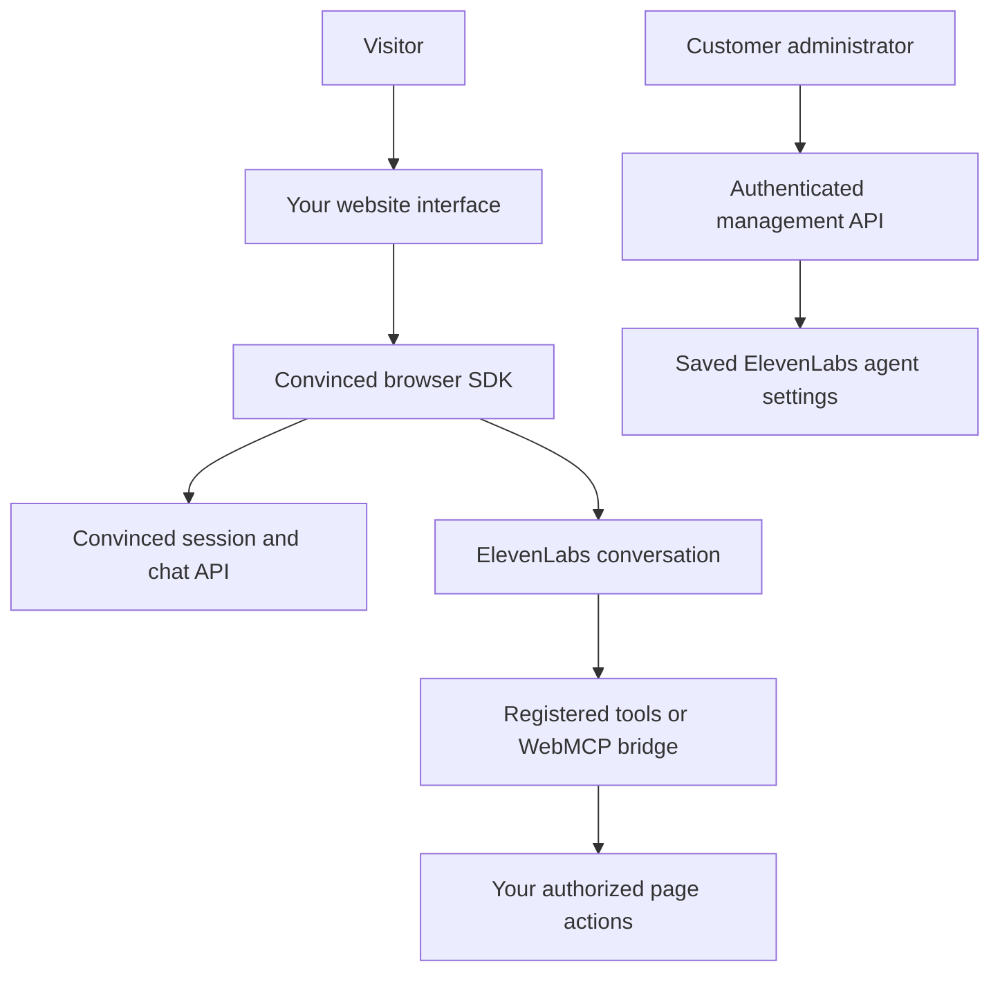

The Convinced Widget SDK is a JavaScript package for adding voice, chat and permitted page actions to your website. Use the supplied widget or build your own interface. It works without React and can be integrated into an existing application.

**Start here when adding the SDK to a new website.** You supply the website's content, routes and useful actions. Adding a new page does not require a new SDK build.

## Choose an integration

| Your goal | Integration | Next step |
| --- | --- | --- |
| Add a ready-made interface inside your page | `mountConvincedWidget()` with the `managed-v2` preset | [SDK quickstart](/guides/widget-sdk/quickstart) |
| Own the entire interface | `ConvincedClient` and `ConvincedVoiceController` | [Custom UI](/guides/widget-sdk/custom-ui) |
| Embed the existing hosted widget | Hosted iframe loader | [Managed iframe](/guides/widget-sdk/managed-iframe) |
| Let the agent use your website's actions | Explicit registry tools, or experimental WebMCP discovery | [Website tools](/guides/widget-sdk/host-tools) · [WebMCP](/guides/widget-sdk/webmcp) |
| Let administrators change saved instructions and the opener | `ConvincedAgentAdmin` in an authenticated management interface | [Prompts and first message](/guides/widget-sdk/agent-prompts) |

The quickstart uses the supplied `managed-v2` interface. Choose [headless integration](/guides/widget-sdk/custom-ui#when-to-use-headless) when your application owns the interface. Both use the same SDK voice and tool APIs.

The hosted iframe and the JavaScript SDK are separate integrations. The published iframe loader does not expose the SDK's host-tool registration or WebMCP bridge. Choose the JavaScript SDK when your agent needs to act on the parent page.

## Before you start

- Get your Convinced organization slug and widget configuration from your Convinced administrator. Configure the website's allowed origin and supply a widget token if required.
- For voice, get the intended ElevenLabs agent ID and configure its matching client tools. A public agent can connect by ID; a private agent needs a server-issued conversation credential.
- Run the visitor page over HTTPS, or localhost during development, for microphone access. Start voice from a visitor's button press.
- For npm, use Node.js 22.14 or newer and your application's JavaScript bundler. A standalone browser bundle is also included.

Campaigns are optional. An ordinary page can create a session without a campaign link. See [campaign sessions](/guides/widget-sdk/campaigns) for personalized campaign experiences.

## Install

These guides target the published prerelease **`0.1.1-webmcp.2`**:

```bash
npm install --save-exact @convinced/widget-sdk@0.1.1-webmcp.2
```

Commit your lockfile. This version is under npm's `next` tag; the unversioned install selects `latest`, which remains `0.1.0` and lacks WebMCP and saved prompt administration. The [tagged source](https://github.com/Get-Convinced/convinced-widget-sdk/tree/v0.1.1-webmcp.2) matches these guides.

## How the pieces connect



The website owns its page actions and access checks. Convinced owns its hosted session service. ElevenLabs runs the voice conversation. Saved prompt editing uses a separate authenticated management API; visitor credentials do not grant administration access.

## Current availability

Applies to SDK `0.1.1-webmcp.2` and the hosted services verified on September 14, 2026. SDK exports and deployed backend features are listed separately.

| Capability | Current status |
| --- | --- |
| Hosted widget configuration, session initialization and session end | Verified against the deployed Convinced backend |
| Public ElevenLabs connection, managed UI and explicit voice tools | Implemented in the SDK; configure the agent and test your real voice flow |
| Saved system prompt and first message | Management API deployed; requires Convinced organization ADMIN authentication and a registered agent owner |
| WebMCP discovery and execution | Experimental; native browser transport tested, real voice task acceptance still required |
| `client.getVoiceCredential()` for private voice | **Unavailable on the hosted backend**; its endpoint returned `404`. Use your own authenticated credential service as described in [voice](/guides/widget-sdk/voice) |
| Signed session capabilities and chat tool continuation | SDK protocol support exists; the hosted routes do not provide the complete protocol. Do not depend on these server guarantees |
| Host tools through the hosted iframe loader | Unavailable; use the JavaScript SDK for website actions |

See [security](/guides/widget-sdk/security) and the [capability matrix](/guides/widget-sdk/migration) before choosing features for production.

## Add more pages and websites

Keep one SDK owner mounted across SPA route changes. Update the page context, register the route's actions and remove tools that are no longer available. Use existing application controllers so a tool produces the same observable result as the interface.

WebMCP lets the agent discover website actions through two fixed callbacks. Each website must still expose its own tools, validate arguments and enforce permissions. This SDK bridge supports same-origin discovery in compatible browsers; it does not give an agent automatic control of arbitrary websites.

Keep saved agent instructions general: discover the current page's capabilities, use their schemas and confirm the returned outcome. Supply page-specific names, IDs and content as context or tool results. Adding the SDK to another page does not rewrite an existing page-specific agent prompt.

## Build your integration

<CardGroup cols={2}>
  <Card title="SDK quickstart" icon="microphone-lines" href="/guides/widget-sdk/quickstart">Install, initialize a session and mount the supplied interface.</Card>
  <Card title="Build with a coding agent" icon="wand-magic-sparkles" href="/guides/widget-sdk/build-with-an-agent">Use a reviewed implementation prompt and acceptance checklist.</Card>
  <Card title="WebMCP website tools" icon="globe" href="/guides/widget-sdk/webmcp">Expose website actions and configure discovery and execution.</Card>
  <Card title="Implementation checklist" icon="clipboard-check" href="/guides/widget-sdk/client-handoff">Verify ownership and actual task outcomes before launch.</Card>
</CardGroup>
