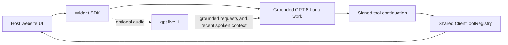

`@convinced/widget-sdk` 0.1.6 has a headless core. It manages a Convinced conversation, optional speech I/O, host tools, and session lifecycle without requiring React. Build every visual surface in your application, or opt into the package's `mountConvincedWidget()` convenience renderer.

Version 0.1.6 addresses GPT Live append-size failures for grounded answers and page context. The SDK sends a concise spoken excerpt while keeping the full Luna answer in the client, and splits context updates into smaller ordered messages. See [Live payload limits](/guides/widget-sdk/voice#live-payload-limits).

The only agent identifier exposed in browser configuration is `agentId`, the public ID of a Convinced `AgentDeployment`. Do not put an OpenAI key, a model-provider ID, or any other provider credential in browser code.

## One conversation, two inputs

Text and speech share one Convinced session. `gpt-6-luna` handles typed input and requests that need grounded organization knowledge, page context, slides, or tools.

- `client.sendMessage()` sends typed input directly to the `gpt-6-luna` conversation.
- Optional `gpt-live-1` provides full-duplex speech and answers greetings and conversational clarifications directly.
- Live delegates requests that need organization knowledge, page context, slides, or tools to `gpt-6-luna`.
- Completed Live-native user/assistant pairs enter `client.state.messages`, so typed and delegated Luna requests share the available conversation history.
- When voice is active, a typed turn still enters the same conversation and its answer is spoken.
- Disabling or ending voice leaves chat active.
- A chat-only integration never creates an OpenAI Live session.

Convinced's backend owns OpenAI credentials, model selection, prompts, knowledge, and the delegation bridge.



## What the host owns

In a headless integration, the host website decides how to present SDK state. It can render a floating panel, an inline guide, a full-page experience, or no persistent surface at all. The same applies to slide placement, transitions, consent UI, form fields, and error states.

The optional managed renderer supplies a functional Shadow DOM interface, voice and chat controls, identity UI, and deployment-driven presentation. Pass the same client and Live controller to it:

```ts
const live = client.createLiveController()
const widget = mountConvincedWidget({ client, voice: live })
```

The renderer is a convenience layer over the same headless APIs. Use a custom renderer when the host must own exact layout, theme, slide behavior, or form behavior.

Use one `ClientToolRegistry` for chat and voice. The Convinced backend pauses a `gpt-6-luna` turn and returns the browser an opaque signed continuation. The SDK validates the requested call against the local registry and host policy, executes the handler, and returns the opaque continuation with the result. The backend verifies the signature and exact call binding before it resumes the turn. WebMCP tools use the same registry and policy.

## Start here

<CardGroup cols={2}>
  <Card title="Quickstart" icon="bolt" href="/guides/widget-sdk/quickstart">Create a chat-only conversation, then opt in to voice.</Card>
  <Card title="Custom UI" icon="palette" href="/guides/widget-sdk/custom-ui">Render state and content in your framework.</Card>
  <Card title="Voice" icon="microphone-lines" href="/guides/widget-sdk/voice">Understand Live delegation and channel behavior.</Card>
  <Card title="SDK API map" icon="code" href="/guides/widget-sdk/api-reference">Find the public 0.1.6 surface.</Card>
</CardGroup>
