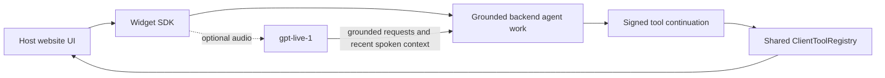

`@convinced/widget-sdk` 0.1.8 has a headless core. It manages a Convinced conversation, optional speech I/O, host tools, and session lifecycle without requiring React. Build every visual surface in your application, or opt into the package's `mountConvincedWidget()` convenience renderer.

Version 0.1.8 lets the Convinced backend agent carry a request through knowledge and browser tools while Live handles speech. The backend agent can supply a short spoken briefing alongside the full written answer. The SDK stops a superseded delegated turn before starting later browser actions. See [Optional Live voice](/guides/widget-sdk/voice).

The only agent identifier exposed in browser configuration is `agentId`, the public ID of a Convinced `AgentDeployment`. Do not put an OpenAI key, a model-provider ID, or any other provider credential in browser code.

## Availability and validation status

SDK **0.1.8** is the current release. It works with the matching Convinced backend deployment. Published 0.1.7 remains unchanged and does not include the 0.1.8 additions below.

| Capability | SDK 0.1.8 and matching backend | SDK 0.1.7 |
| --- | --- | --- |
| Headless chat, optional managed UI, identity/forms, slides and WebMCP | Preserved; host integration and backend configuration still required | 0.1.7 behavior remains available |
| Live voice and short final voice briefings | Included, subject to real-browser acoustic acceptance | Supported |
| Incremental verified findings during delegated work | Included with the matching backend | Final-only streaming; no `text_reset` support |
| Automatic semantic page observations and section focus | Included with a matching backend; public main content, exclusion controls and bounded session-only visited-page context | Not available |
| `client.describeScreen()` | Experimental; matching authenticated backend and visitor-approved tab capture required | Not available |
| Independent overlapping transcript buffers, replayed-event protection, correlated mute acknowledgements | Included; automated checks do not establish acoustic acceptance | Not available |

<Warning>
  Voice acoustic acceptance remains open because of an unresolved report of false caller transcriptions during silence, including while muted, with speech interruptions. Ending voice stopped the reported behavior. Later synthetic-silence testing reproduced phantom caller fragments before a prerecorded utterance played. Local transcript and mute-acknowledgement fixes do not establish that this issue is resolved. Keep text available; see [voice troubleshooting](/guides/widget-sdk/voice#known-issue-false-input-during-silence).
</Warning>

Use the [migration guide](/guides/widget-sdk/migration) to upgrade an earlier SDK and verify the matching backend configuration.

## One conversation, two inputs

Text and speech share one Convinced session. The backend agent handles typed input and requests that need grounded organization knowledge, page context, slides, or tools.

- `client.sendMessage()` sends typed input directly to the backend conversation.
- Optional `gpt-live-1` provides full-duplex speech and answers greetings and conversational clarifications directly.
- Live delegates requests that need organization knowledge, page context, slides, or tools to the backend agent.
- Completed Live-native user/assistant pairs enter `client.state.messages`, so typed and delegated backend agent requests share the available conversation history.
- When voice is active, a typed turn still enters the same conversation and its answer is spoken. A newly submitted typed turn supersedes an unfinished delegated voice turn.
- Disabling or ending voice leaves chat active.
- A chat-only integration never creates an OpenAI Live session.

Convinced's backend owns OpenAI credentials, model selection, prompts, knowledge, and the delegation bridge. The browser does not select a provider model.

The Convinced backend uses GPT-6.1 Sol with `reasoning.effort: low` through the Responses API. Optional speech continues to use `gpt-live-1`. Model configuration and credentials stay on the server.


```mermaid
flowchart LR
  UI[Host website UI] --> SDK[Widget SDK]
  SDK --> Chat[Grounded backend agent work]
  SDK -. optional audio .-> Live[gpt-live-1]
  Live -->|grounded requests and recent spoken context| Chat
  Chat --> Tools[Signed tool continuation]
  Tools --> Registry[Shared ClientToolRegistry]
  Registry --> UI
```

## What the host owns

In a headless integration, the host website decides how to present SDK state. It can render a floating panel, an inline guide, a full-page experience, or no persistent surface at all. The same applies to slide placement, transitions, consent UI, form fields, and error states.

The optional managed renderer supplies a functional Shadow DOM interface, voice and chat controls, identity UI, and deployment-driven presentation. Pass the same client and Live controller to it:

```ts
const live = client.createLiveController()
const widget = mountConvincedWidget({ client, voice: live })
```

The renderer is a convenience layer over the same headless APIs. Use a custom renderer when the host must own exact layout, theme, slide behavior, or form behavior.

Use one `ClientToolRegistry` for chat and voice. The Convinced backend pauses a backend turn before a browser tool, keeps the agent's run state on the server, and returns the browser an opaque signed continuation. The SDK validates the requested call against the local registry and host policy, executes the handler, and returns the result. The backend checks the signed call and one-use continuation before the backend agent resumes with that observation. WebMCP tools use the same registry and policy.

## Start here

<CardGroup cols={2}>
  <Card title="Quickstart" icon="bolt" href="/guides/widget-sdk/quickstart">Create a chat-only conversation, then opt in to voice.</Card>
  <Card title="Custom UI" icon="palette" href="/guides/widget-sdk/custom-ui">Render state and content in your framework.</Card>
  <Card title="Voice" icon="microphone-lines" href="/guides/widget-sdk/voice">Understand Live delegation and channel behavior.</Card>
  <Card title="SDK API map" icon="code" href="/guides/widget-sdk/api-reference">Find the public 0.1.8 surface.</Card>
</CardGroup>
